# 路由转发管理系统

## 项目概述

路由转发管理系统是一个基于Spring Cloud微服务架构构建的专业级应用，旨在实现灵活、高效的请求路由和转发管理。系统采用前后端分离设计，提供直观的用户界面和强大的后端服务，适用于API网关管理、微服务治理和系统集成场景。

### 核心功能

- **动态路由配置**：支持HTTP/HTTPS/TCP/UDP协议路由规则的灵活配置与实时更新
- **用户权限管理**：多级用户角色体系，精细化权限控制
- **项目分组管理**：支持按项目组织和管理路由配置
- **文档支持**：集成Markdown文档编辑，方便记录API说明与使用方法
- **可视化监控**：直观的控制面板，实时监控系统运行状态

## 系统架构

### 整体架构

系统采用经典的微服务架构，包含以下核心组件：

#### 后端服务

1. **Spring核心服务** (端口: 8083)
   - 基于Spring Boot 3.4.4构建
   - 负责用户认证、权限管理、业务逻辑处理等核心功能
   - 主要技术组件：
     - Spring Security + JWT：提供安全认证与授权
     - MyBatis-Plus：高效ORM框架，简化数据库操作
     - Spring Data JPA：提供数据访问抽象层
     - Redis：高性能缓存，提升系统响应速度
     - MySQL：可靠的数据持久化存储
     - Spring Cloud LoadBalancer：智能负载均衡

2. **SpringCloud服务** (端口: 8084)
   - 基于Spring Boot 3.4.4构建
   - 专注于微服务路由转发控制
   - 处理实际的请求转发与响应处理
   - 技术栈：Spring Boot Web

#### 前端应用

- **Vue前端**
  - 基于Vue 3.5.13开发
  - 核心框架与库：
    - Vue Router 4.5.0：前端路由管理
    - Pinia 3.0.1：下一代状态管理
    - Element Plus：美观易用的UI组件库
    - Axios：高效HTTP客户端
    - Echarts：强大的数据可视化图表
    - Vue Flow：直观的流程图组件
  - 构建工具：Vite 6.1.0
  - 开发语言：TypeScript 5.7.3

### 技术架构流程

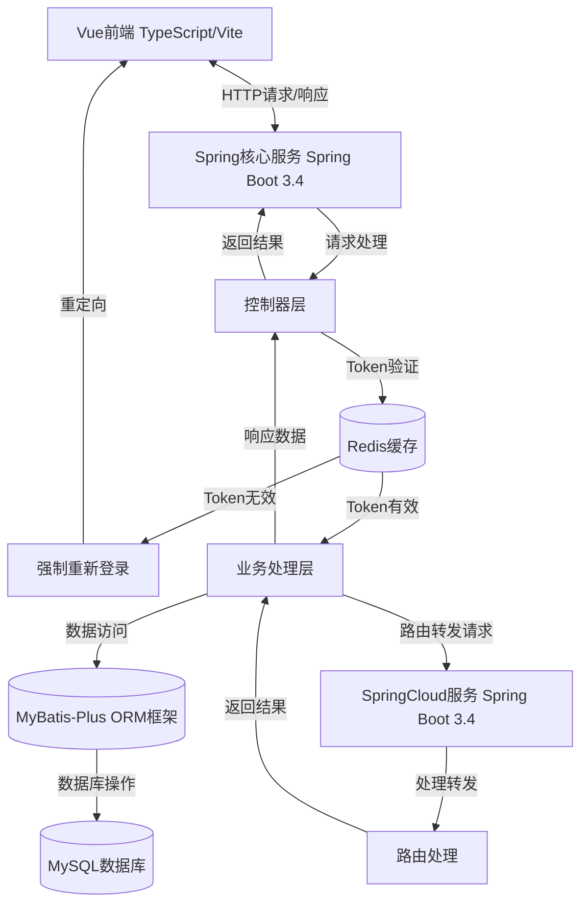

## 项目结构

```
/
├── spring/                # Spring核心服务
│   ├── src/main/java/
│   │   └── com/david/hlp/Spring/
│   │       ├── cloud/     # 云服务相关组件
│   │       ├── common/    # 公共工具和类
│   │       ├── repeater/  # 请求重复器服务
│   │       ├── system/    # 系统核心功能
│   │       └── SpringBootStarter.java  # 主启动类
│   └── src/main/resources/
│       ├── application.yml # 应用配置文件
│       └── mapper/        # MyBatis映射文件
│
├── Cloud/                 # SpringCloud测试服务
│   ├── src/main/java/
│   │   └── com/david/hlp/cloud/
│   │       ├── controller/ # 控制器
│   │       ├── entity/     # 实体类
│   │       └── SpringCloudStarter.java # 微服务启动类
│   └── src/main/resources/
│       └── application.yml # 微服务配置文件
│
└── vue/                  # 前端应用
    ├── src/             # 源代码
    ├── public/          # 静态资源
    └── package.json     # 依赖管理
```

## 核心功能模块

### 用户认证与授权

- **多用户角色**：内置ADMIN和USER角色，可扩展自定义角色
- **JWT令牌认证**：安全高效的身份验证机制
- **权限精细控制**：基于RBAC模型的权限管理，支持菜单级和操作级权限

### 路由管理

- **多协议支持**：HTTP、HTTPS、TCP、UDP等协议的路由转发
- **动态配置**：支持运行时更新路由规则，无需重启服务
- **URL规则管理**：灵活配置路径匹配、请求方法、参数处理等规则

### 项目管理

- **项目分组**：按项目组织路由规则，便于管理和维护
- **Markdown文档**：支持为项目添加丰富的文档说明
- **多角色协作**：支持团队协作管理项目

### 权限控制

- **角色权限管理**：为不同角色分配不同的访问权限
- **用户-角色-项目关联**：建立用户与项目的权限关系
- **安全访问控制**：保障系统资源安全可控

## 系统功能展示

### 控制面板
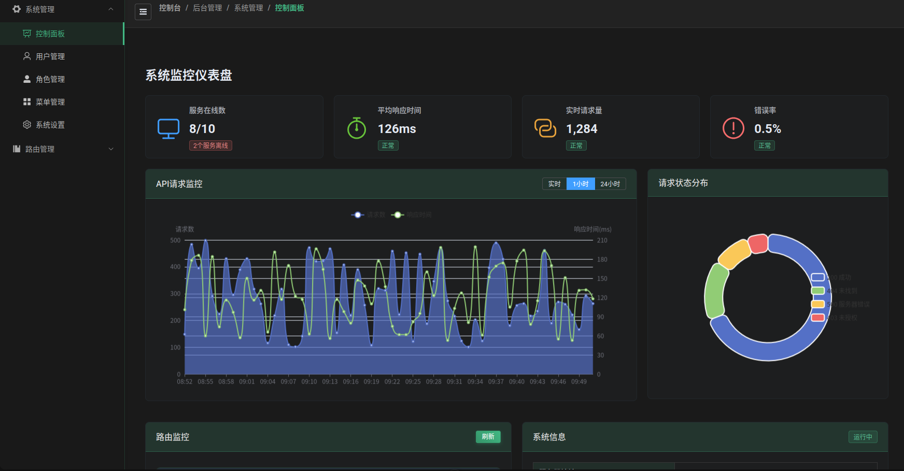
集中展示系统关键指标和状态，包括活跃用户数、路由总数、请求统计等信息。

### 用户管理

管理系统用户账号，包括创建、编辑和删除用户，以及分配用户角色。

### 角色管理
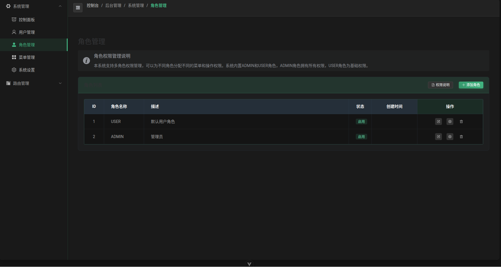
定义和管理系统角色，设置角色的权限范围和访问级别。

### 菜单管理
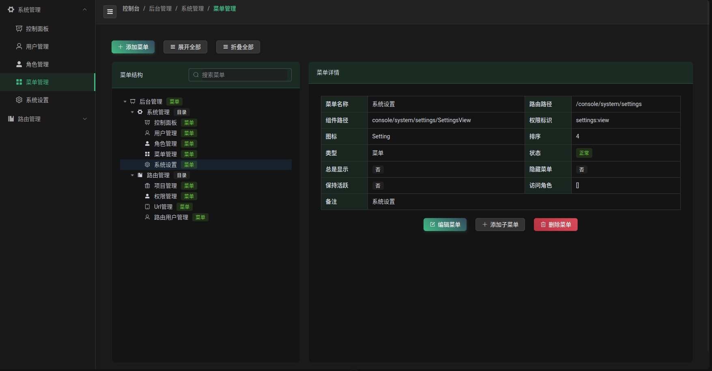
配置系统菜单结构，控制不同角色对功能模块的访问权限。

### 项目管理
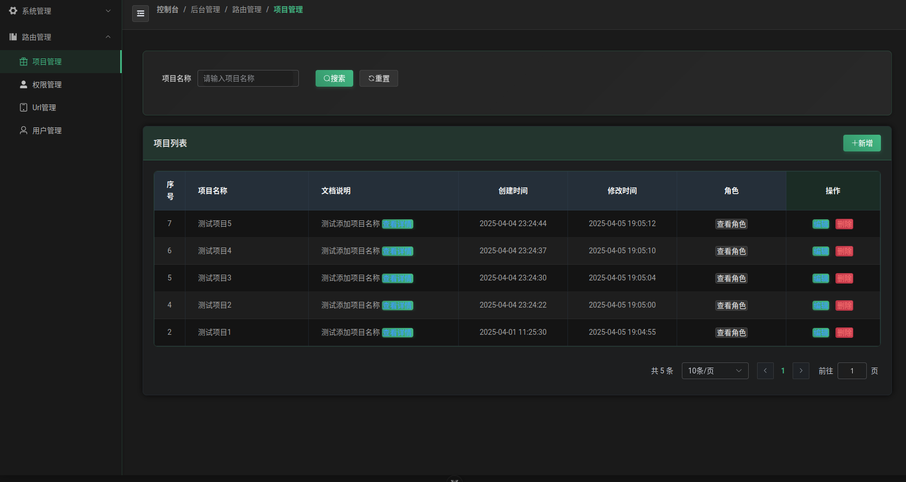
创建和管理项目分组，组织和分类路由规则。

#### 项目编辑
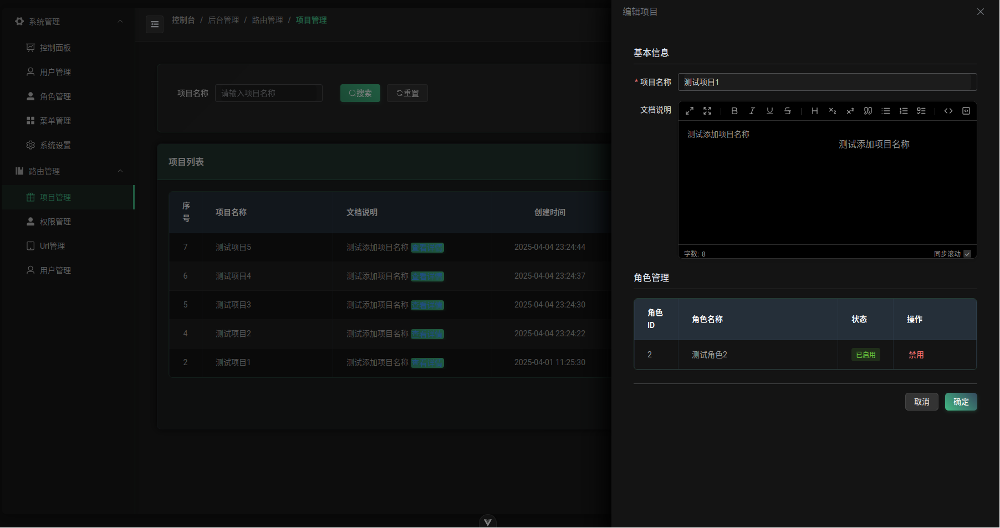
编辑项目信息，支持使用Markdown格式添加详细项目说明文档。

### 权限管理
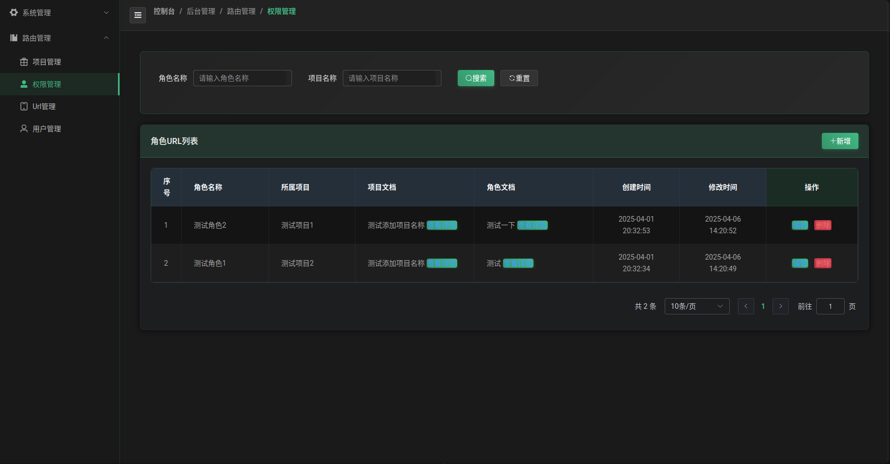
设置角色对URL的访问权限，确保系统安全性。

#### 权限编辑
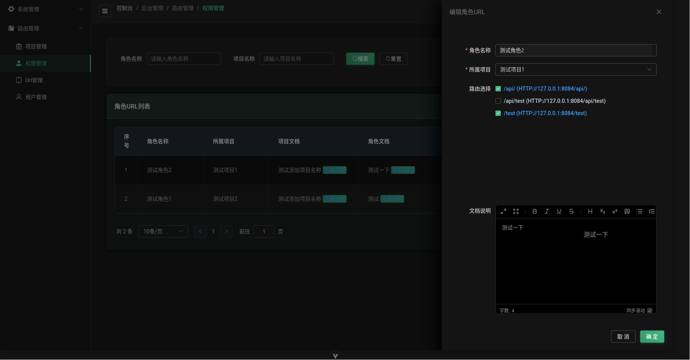
精细配置角色权限，包括菜单访问和操作权限。

### URL管理
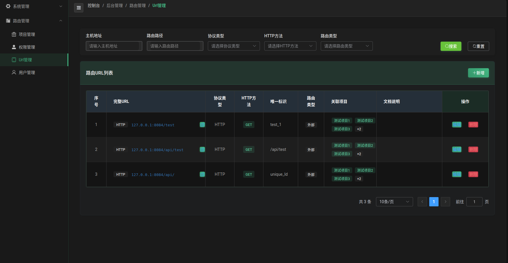
管理系统中所有路由URL，支持按协议类型、主机名等筛选。

#### URL编辑
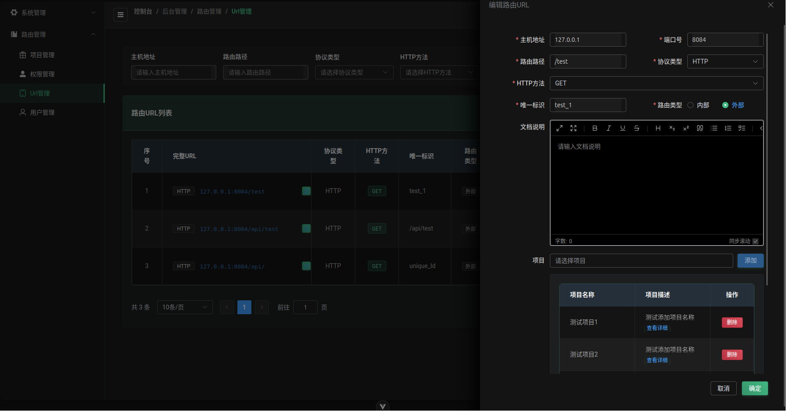
编辑URL详细信息，配置路由规则和转发策略。

### 用户管理
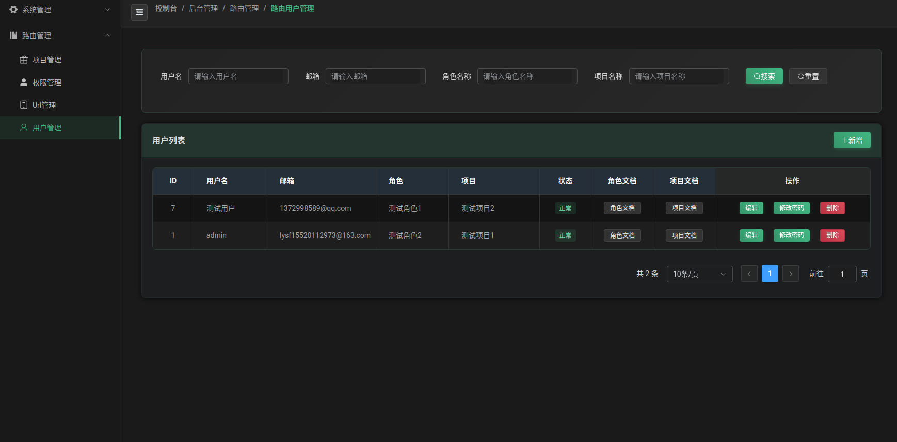
管理用户账号和访问权限，包括用户状态控制。

#### 用户编辑
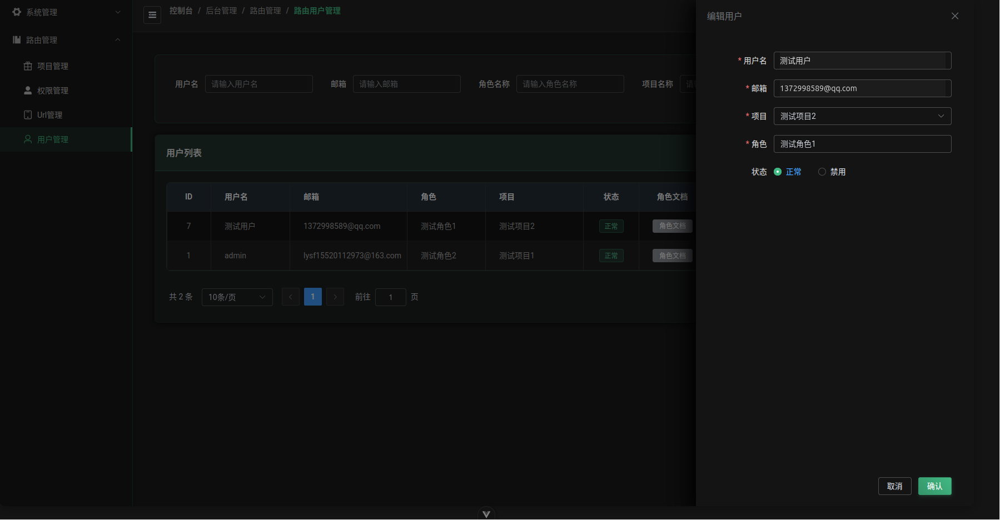
编辑用户信息，分配角色和项目权限。

## 技术特色

1. **微服务架构**：基于Spring Cloud构建，实现服务解耦和独立扩展
2. **安全认证机制**：结合JWT和Redis实现高效安全的用户认证
3. **响应式前端**：Vue 3 + TypeScript提供类型安全和高性能的用户界面
4. **数据可视化**：集成Echarts和Vue Flow提供直观的数据展示
5. **文档集成**：支持Markdown格式的文档编辑与展示
6. **权限精细控制**：基于RBAC的多维度权限管理

## 适用场景

- **API网关管理**：集中管理和控制微服务API访问
- **测试环境路由**：灵活配置测试环境的请求转发规则
- **系统集成平台**：作为不同系统间的请求转发和集成中心
- **微服务治理**：监控和管理微服务间的调用关系