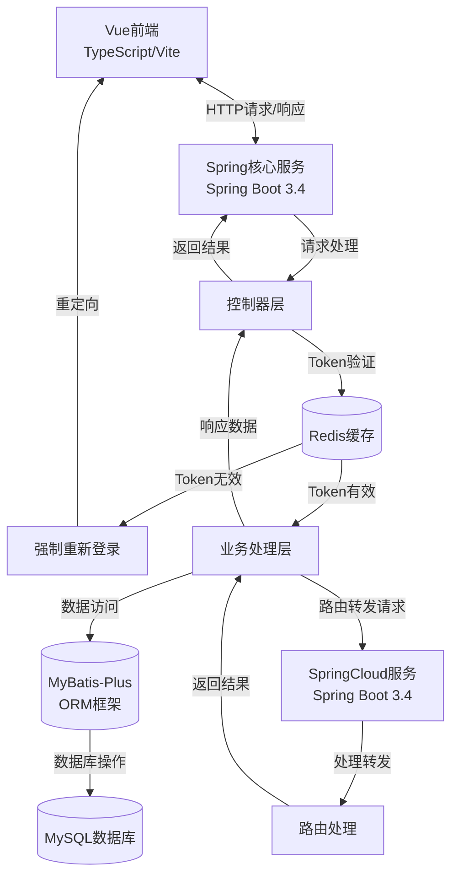

# 路由转发管理系统

基于SpringCloide微服务架构，实现路由转发管理系统。

## 项目架构

### 后端服务

1. **Spring核心服务** (port: 8083)
   - 基于Spring Boot 3.4.4
   - 主要功能：系统核心业务逻辑处理
   - 核心组件：
     - Spring Security + JWT：认证授权
     - MyBatis-Plus：ORM框架
     - Spring Data JPA：数据访问
     - Redis：缓存服务
     - MySQL：数据持久化
     - Spring Cloud LoadBalancer：负载均衡

2. **SpringCloud服务** (port: 8084)
   - 基于Spring Boot 3.4.4
   - 主要功能：微服务路由、转发控制
   - 技术栈：Spring Boot Web

### 前端应用

- **Vue前端**
  - 基于Vue 3.5.13
  - 核心框架/库：
    - Vue Router 4.5.0：路由管理
    - Pinia 3.0.1：状态管理
    - Element Plus：UI组件库
    - Axios：HTTP客户端
    - Echarts：数据可视化
    - Vue Flow：流程图组件
  - 构建工具：Vite 6.1.0
  - 语言：TypeScript 5.7.3

### 项目结构

```
/
├── spring/                # Spring核心服务
│   ├── src/main/java/
│   │   └── com/david/hlp/Spring/
│   │       ├── cloud/     # 云服务相关组件
│   │       ├── common/    # 公共工具和类
│   │       ├── repeater/  # 请求重复器服务
│   │       ├── system/    # 系统核心功能
│   │       └── SpringBootStarter.java  # 主启动类
│   └── src/main/resources/
│       ├── application.yml # 应用配置文件
│       └── mapper/        # MyBatis映射文件
│
├── Cloud/                 # SpringCloud测试服务
│   ├── src/main/java/
│   │   └── com/david/hlp/cloud/
│   │       ├── controller/ # 控制器
│   │       ├── entity/     # 实体类
│   │       └── SpringCloudStarter.java # 微服务启动类
│   └── src/main/resources/
│       └── application.yml # 微服务配置文件
│
└── vue/                  # 前端应用
    ├── src/             # 源代码
    ├── public/          # 静态资源
    └── package.json     # 依赖管理
```

### 技术架构图



系统采用前后端分离架构，后端基于Spring Cloud微服务设计，具有良好的扩展性和模块化特性。

