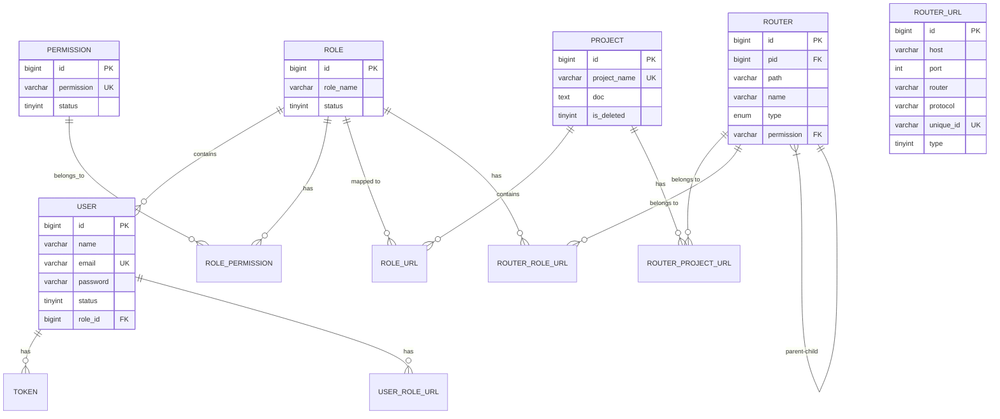
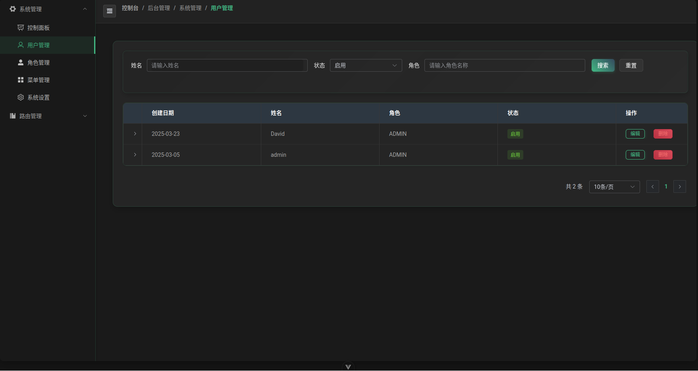

# 路由转发管理系统

## 1. 项目概述

路由转发管理系统是一个基于Spring Cloud微服务架构构建的专业级应用，旨在实现灵活、高效的请求路由和转发管理。系统采用前后端分离设计，提供直观的用户界面和强大的后端服务，适用于API网关管理、微服务治理和系统集成场景。

### 1.1 系统价值

- **灵活的路由管理**：集中式管理API路由，减少配置复杂度
- **提升开发效率**：简化微服务间调用方式，降低集成门槛
- **增强系统安全**：精细化的访问控制，保障服务间通信安全
- **可视化运维**：直观展示系统运行状态，降低运维成本

### 1.2 核心功能

- **动态路由配置**：支持HTTP/HTTPS/TCP/UDP协议路由规则的灵活配置与实时更新
- **用户权限管理**：多级用户角色体系，精细化权限控制
- **项目分组管理**：支持按项目组织和管理路由配置
- **文档支持**：集成Markdown文档编辑，方便记录API说明与使用方法
- **可视化监控**：直观的控制面板，实时监控系统运行状态

## 2. 技术栈概览

### 2.1 后端技术

- **核心框架**：Spring Boot 3.4.4 + Spring Cloud
- **安全框架**：Spring Security + JWT
- **数据存储**：MySQL + Redis
- **ORM框架**：MyBatis-Plus + Spring Data JPA
- **服务治理**：Spring Cloud LoadBalancer

### 2.2 前端技术

- **核心框架**：Vue 3.5.13 + TypeScript 5.7.3
- **构建工具**：Vite 6.1.0
- **状态管理**：Pinia 3.0.1
- **UI组件库**：Element Plus
- **数据可视化**：Echarts + Vue Flow
- **HTTP客户端**：Axios

## 3. 系统架构

### 3.1 总体架构

系统采用经典的微服务架构，主要分为前端应用和后端服务两大部分：

1. **前端应用**：基于Vue的单页面应用，提供用户交互界面
2. **后端服务**：
   - Spring核心服务：提供业务逻辑处理和权限管理
   - SpringCloud服务：负责具体的路由转发实现

### 3.2 详细组件

#### 3.2.1 后端服务

1. **Spring核心服务** (端口: 8083)
   - 基于Spring Boot 3.4.4构建
   - 负责用户认证、权限管理、业务逻辑处理等核心功能
   - 主要技术组件：
     - Spring Security + JWT：提供安全认证与授权
     - MyBatis-Plus：高效ORM框架，简化数据库操作
     - Spring Data JPA：提供数据访问抽象层
     - Redis：高性能缓存，提升系统响应速度
     - MySQL：可靠的数据持久化存储
     - Spring Cloud LoadBalancer：智能负载均衡

2. **SpringCloud服务** (端口: 8084)
   - 基于Spring Boot 3.4.4构建
   - 专注于微服务路由转发控制
   - 处理实际的请求转发与响应处理
   - 技术栈：Spring Boot Web

#### 3.2.2 前端应用

- **Vue前端**
  - 基于Vue 3.5.13开发
  - 核心框架与库：
    - Vue Router 4.5.0：前端路由管理
    - Pinia 3.0.1：下一代状态管理
    - Element Plus：美观易用的UI组件库
    - Axios：高效HTTP客户端
    - Echarts：强大的数据可视化图表
    - Vue Flow：直观的流程图组件

### 3.3 技术架构流程


### 3.4 项目结构

```
/
├── spring/                # Spring核心服务
│   ├── src/main/java/
│   │   └── com/david/hlp/Spring/
│   │       ├── cloud/     # 云服务相关组件
│   │       ├── common/    # 公共工具和类
│   │       ├── repeater/  # 请求重复器服务
│   │       ├── system/    # 系统核心功能
│   │       └── SpringBootStarter.java  # 主启动类
│   └── src/main/resources/
│       ├── application.yml # 应用配置文件
│       └── mapper/        # MyBatis映射文件
│
├── Cloud/                 # SpringCloud测试服务
│   ├── src/main/java/
│   │   └── com/david/hlp/cloud/
│   │       ├── controller/ # 控制器
│   │       ├── entity/     # 实体类
│   │       └── SpringCloudStarter.java # 微服务启动类
│   └── src/main/resources/
│       └── application.yml # 微服务配置文件
│
└── vue/                  # 前端应用
    ├── src/             # 源代码
    ├── public/          # 静态资源
    └── package.json     # 依赖管理
```

## 4. 核心功能体系

### 4.1 基础功能

#### 4.1.1 用户认证与授权

- **账号管理**：用户注册、登录、密码找回
- **多用户角色**：内置ADMIN和USER角色，可扩展自定义角色
- **JWT令牌认证**：安全高效的身份验证机制
- **权限精细控制**：基于RBAC模型的权限管理，支持菜单级和操作级权限

#### 4.1.2 路由基础管理

- **路由配置**：支持基本的路由地址、端口配置
- **协议类型**：支持HTTP、HTTPS基础协议
- **状态查看**：查看路由运行状态

### 4.2 进阶功能

#### 4.2.1 路由高级管理

- **多协议支持**：扩展支持TCP、UDP等协议的路由转发
- **动态配置**：支持运行时更新路由规则，无需重启服务
- **URL规则管理**：灵活配置路径匹配、请求方法、参数处理等规则
- **负载均衡**：支持多目标服务的负载均衡策略

#### 4.2.2 项目管理

- **项目分组**：按项目组织路由规则，便于管理和维护
- **Markdown文档**：支持为项目添加丰富的文档说明
- **多角色协作**：支持团队协作管理项目

### 4.3 高级功能

#### 4.3.1 权限控制

- **角色权限管理**：为不同角色分配不同的访问权限
- **用户-角色-项目关联**：建立用户与项目的权限关系
- **安全访问控制**：保障系统资源安全可控

#### 4.3.2 系统监控

- **实时监控**：监控路由请求量、响应时间等指标
- **异常告警**：配置异常阈值，触发告警通知
- **历史数据**：查看历史趋势，辅助决策分析

## 5. 接口规范

### 5.1 路由接口

目前系统仅支持POST请求方式。

#### 5.1.1 请求格式

```java
{
  uniqueId: String, // 路由唯一标识符
  data:{
    // 所需要添加的参数信息
  }
}
```

#### 5.1.2 返回格式

用户只需处理data数据即可

```java
{
  code: Number,
  data:{
    // 返回信息
  },
  message: String
}
```

## 6. 数据模型设计

### 6.1 核心业务模型

系统的核心业务模型包括：
- **用户（User）**：系统使用者，具有不同权限
- **角色（Role）**：用户的角色分类，决定权限范围
- **项目（Project）**：路由规则的组织单元
- **路由（Router）**：实际的路由转发规则

### 6.2 数据库设计

系统采用MySQL数据库存储核心数据，遵循阿里巴巴Java开发规范设计。

#### 6.2.1 用户与权限相关表

1. **user表**：用户基本信息
   - `id`：用户ID，主键自增
   - `name`：用户名称
   - `email`：用户邮箱（唯一）
   - `password`：加密后的密码
   - `status`：用户状态(0-禁用，1-启用)
   - `role_id`：关联的角色ID
   - `avatar`：用户头像
   - `introduction`：用户简介
   - `last_login`：最后登录时间
   - `create_time`：创建时间

2. **user_url表**：用户信息表（API调用使用）
   - `id`：主键ID
   - `username`：用户名
   - `password`：加密密码
   - `email`：邮箱
   - `phone`：手机号
   - `status`：状态(0-正常，1-禁用)
   - `is_deleted`：逻辑删除标志(0-未删除，1-已删除)

3. **role表**：角色定义
   - `id`：角色ID，主键自增
   - `role_name`：角色名称
   - `status`：状态(0-禁用，1-启用)
   - `remark`：备注说明
   - `create_time`：创建时间

4. **permission表**：权限定义
   - `id`：权限ID，主键自增
   - `permission`：权限标识符
   - `status`：状态(0-禁用，1-启用)
   - `remark`：备注说明
   - `create_time`：创建时间

5. **role_permission表**：角色-权限关联
   - `role_id`：角色ID
   - `permission_id`：权限ID
   - 联合主键(role_id, permission_id)，实现多对多关系

#### 6.2.2 路由与项目相关表

1. **router表**：前端路由配置
   - `id`：路由ID，主键自增
   - `pid`：父路由ID，实现层级结构
   - `path`：路由路径
   - `name`：路由名称
   - `type`：类型(C-目录，M-菜单，F-功能)
   - `component`：组件路径
   - `permission`：权限标识
   - `meta_title`：显示标题
   - `meta_icon`：图标
   - `meta_hidden`：是否隐藏
   - `meta_roles`：可访问角色列表(JSON格式)

2. **router_url表**：接口路由信息
   - `id`：主键ID
   - `host`：主机地址
   - `port`：端口号
   - `router`：路由路径
   - `protocol`：协议类型
   - `unique_id`：唯一标识
   - `type`：路由类型(0-内部，1-外部)
   - `http_method`：HTTP方法类型(0-GET，1-POST，2-PUT，3-DELETE)
   - `doc`：接口文档说明

3. **project表**：项目信息
   - `id`：项目ID
   - `project_name`：项目名称
   - `doc`：项目文档
   - `is_deleted`：逻辑删除标志

#### 6.2.3 关系映射表

1. **token表**：用户令牌
   - `id`：主键ID
   - `user_id`：用户ID
   - `token`：令牌值
   - `token_type`：令牌类型
   - `expired`：是否过期
   - `revoked`：是否已撤销
   - `create_time`：创建时间

2. **role_url表**：角色项目关联
   - `id`：主键ID
   - `role_name`：角色名称
   - `project_id`：项目ID
   - `doc`：说明文档
   - `is_deleted`：逻辑删除标志

3. **router_project_url表**：路由与项目关联
   - `id`：主键ID
   - `router_id`：路由ID
   - `project_id`：项目ID
   - `is_deleted`：逻辑删除标志

4. **router_role_url表**：路由与角色关联
   - `id`：主键ID
   - `router_id`：路由ID
   - `role_id`：角色ID
   - `is_deleted`：逻辑删除标志

5. **user_role_url表**：用户与角色关联
   - `id`：主键ID
   - `user_id`：用户ID
   - `role_id`：角色ID
   - `is_deleted`：逻辑删除标志

### 6.3 数据库设计特点

1. **逻辑删除**：大部分表采用`is_deleted`字段实现逻辑删除，避免物理删除带来的数据一致性问题
2. **时间戳管理**：所有表都有`gmt_create`和`gmt_modified`(或`create_time`和`update_time`)字段，记录数据创建和修改时间
3. **唯一约束**：针对业务唯一性字段设置唯一索引，如用户名、邮箱、项目名等
4. **外键关联**：通过外键约束保证数据一致性和完整性
5. **RBAC模型**：基于角色的访问控制模型，通过用户-角色-权限三层关系实现灵活的权限控制

### 6.4 ER关系图



## 7. 系统功能展示

### 7.1 基础功能界面

#### 7.1.1 控制面板

> **注意：** 目前控制面板功能尚未实现，仅提供预览图


控制面板集中展示系统关键指标和状态，包括活跃用户数、路由总数、请求统计等信息。

#### 7.1.2 用户管理



管理系统用户账号，包括创建、编辑和删除用户，以及分配用户角色。

#### 7.1.3 角色管理


定义和管理系统角色，设置角色的权限范围和访问级别。

### 7.2 核心功能界面

#### 7.2.1 菜单管理


配置系统菜单结构，控制不同角色对功能模块的访问权限。

#### 7.2.2 项目管理


创建和管理项目分组，组织和分类路由规则。

##### 项目编辑


编辑项目信息，支持使用Markdown格式添加详细项目说明文档。

#### 7.2.3 URL管理


管理系统中所有路由URL，支持按协议类型、主机名等筛选。

##### URL编辑


编辑URL详细信息，配置路由规则和转发策略。

### 7.3 权限管理界面

#### 7.3.1 权限管理


设置角色对URL的访问权限，确保系统安全性。

##### 权限编辑


精细配置角色权限，包括菜单访问和操作权限。

#### 7.3.2 用户账号管理


管理用户账号和访问权限，包括用户状态控制。

##### 用户编辑


编辑用户信息，分配角色和项目权限。

## 8. 系统优势与适用场景

### 8.1 技术特色

1. **微服务架构**：基于Spring Cloud构建，实现服务解耦和独立扩展
2. **安全认证机制**：结合JWT和Redis实现高效安全的用户认证
3. **响应式前端**：Vue 3 + TypeScript提供类型安全和高性能的用户界面
4. **数据可视化**：集成Echarts和Vue Flow提供直观的数据展示
5. **文档集成**：支持Markdown格式的文档编辑与展示
6. **权限精细控制**：基于RBAC的多维度权限管理

### 8.2 适用场景

- **API网关管理**：集中管理和控制微服务API访问
- **测试环境路由**：灵活配置测试环境的请求转发规则
- **系统集成平台**：作为不同系统间的请求转发和集成中心
- **微服务治理**：监控和管理微服务间的调用关系

### 8.3 业务价值

1. **降低开发成本**：简化服务间调用配置，减少重复开发
2. **提高系统稳定性**：集中式路由管理，便于监控和排查问题
3. **增强安全性**：细粒度的权限控制，防止未授权访问
4. **提升维护效率**：可视化界面和文档支持，降低维护门槛